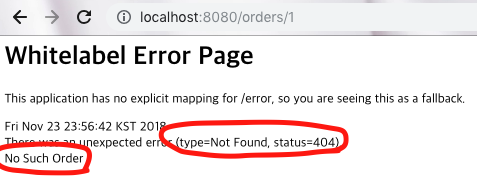

# Exception Handling

## Http Status Code

보통 웹 요청 처리시 발생하는 미처리 예외(Unhandled Exception)은 500 ERROR 응답. 
하지만, @ResponseStatus를 이용해 커스텀한 예외를 작성 할 수 있다.


Custom Exception Handling
```java
@ResponseStatus(value=HttpStatus.NOT_FOUND, reason="No such Order") // 404 
public class OrderNotFoundException extends RuntimeException { 
    // ... 
}

```

그리고 Custom Exception을 사용하는 컨트롤러
```java
@GetMapping("/orders/{id}")
 public String showOrder(@PathVariable("id") long id, Model model) {  
    Order order = orderRepository.findOrderById(id); 
    if (order == null) throw new OrderNotFoundException(id); 
    model.addAttribute(order); 
    return "orderDetail"; 
}
```



## Controller Based Exception Handling

### @ExceptionHandler 사용하기

```java
    @ResponseStatus(value = HttpStatus.CONFLICT, reason = "Data integrity violation")
    @ExceptionHandler(DataIntegrityViolationException.class)
    public void conflict(){
        log.error("Request Raised a Data Integrity Violation Exception");
    }

    @ExceptionHandler({SQLException.class, DataAccessException.class})
    public String databaseError(){
        return "databaseError";
    }

    @ExceptionHandler(Exception.class)
    public ModelAndView handleError(HttpServletRequest req, Exception exception){
        log.error("Request : " + req.getRequestURL() + " raised " + exception);
        ModelAndView modelAndView = new ModelAndView();
        modelAndView.addObject("exception", exception);
        modelAndView.addObject("url", req.getRequestURL());
        modelAndView.setViewName("errorPage");
        return modelAndView;
    }

    @GetMapping("/dataintegrity")
    public void dataIntegityOrder(){
        throw new DataIntegrityViolationException("wow");
    }

    @GetMapping("/db/{param}")
    public String databaseOrder(@PathVariable("param") long param){
        if(param == 1) throw new DataAccessException("wow");
        return "hello";
    }

    @GetMapping("/handling/{param}")
    public String handleOrder(@PathVariable("param") String param) throws Exception {
        throw new Exception(param);
    }
```

## 전역 예외 처리

### @ControllerAdvice
@ControllerAdvice로 등록된 클래스에서 @Controller, @RestController로 선언된 클래스들에서 발생한 예외를 감지한다.

```java
@ControllerAdvice
public class TestAdvice {

    @ExceptionHandler(value = { TestException.class })
    @ResponseStatus(HttpStatus.INTERNAL_SERVER_ERROR)
    @ResponseBody
    protected ErrorMessage handleConflict(RuntimeException ex, WebRequest request) {
    	ErrorMessage em = new ErrorMessage();
    	em.setStatus(HttpStatus.INTERNAL_SERVER_ERROR.toString());
    	em.setMessage(ex.getMessage());
        return em;
    }
}
``` 

### 참조

http://springboot.tistory.com/25#sample-application
<br/>
https://jdm.kr/blog/199
